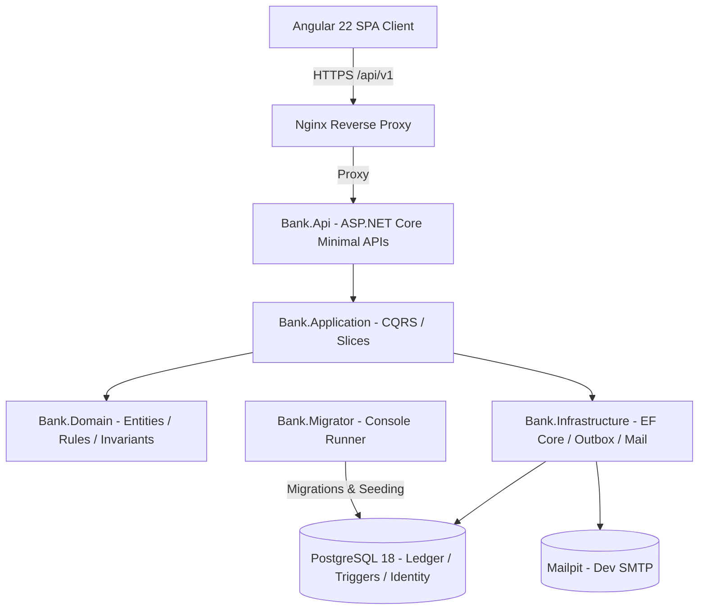

# Architecture Overview

```mermaid
graph TD
    Client[Angular 22 SPA Client] -->|HTTPS /api/v1| Nginx[Nginx Reverse Proxy]
    Nginx -->|Proxy| API[Bank.Api - ASP.NET Core Minimal APIs]
    API --> Application[Bank.Application - CQRS / Slices]
    Application --> Domain[Bank.Domain - Entities / Rules / Invariants]
    Application --> Infrastructure[Bank.Infrastructure - EF Core / Outbox / Mail]
    Infrastructure --> DB[(PostgreSQL 18 - Ledger / Triggers / Identity)]
    Infrastructure --> Mailpit[(Mailpit - Dev SMTP)]
    Migrator[Bank.Migrator - Console Runner] -->|Migrations & Seeding| DB
```

See individual component specifications in:
- [ADRs](../adr/)
- [Database Schema](../database/)
- [API Conventions](../api/)
- [Security Model](../security/)
